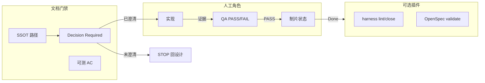

# lite-harness 轻量化修改意见（RFC）

**状态**：提案（未实施）  
**日期**：2026-09-15  
**受众**：lite-harness 维护者与后续实现 agent  
**来源**：CoTrain 多角色评审共识（Unity Tech Lead / Producer / Engineering 连续性 / QA / Systems Design）

本文档描述如何把 lite-harness 从「全量仪式 + 机器门禁」收敛为「**目录级 SSOT + 证据门槛 + ADR + 人工角色门禁**」，脚本与 OpenSpec CLI 降为**可选插件**。不替代 OpenSpec 上游设计，也不写入 CoTrain 专属玩法规则。

---

## 1. 背景与动机

lite-harness 当前将 OpenSpec 变更管理与 `.harness` 脚本、看板、七项自动归档、Generator/Evaluator 提交隔离、`active_change` 唯一执行槽等绑在同一「每轮必做」循环里。对长时 agent 与多角色并行（实现 / 设计 / QA / 制片）而言，出现三类摩擦：

1. **仪式成本**：每轮强制 `harness status`、`openspec list`、维护 `current.json`、看板与 autoclose 就绪度，与「从权威文档恢复上下文」的目标重复，噪声大于信号。  
2. **并发模型错位**：单一 `active_change` 与 Producer 侧多队列、并行角色天然冲突；机器层硬隔离提交（Generator vs Evaluator）在轻量团队或单 agent 场景过重。  
3. **人的判断被脚手架替代风险**：CLI/看板/autoclose 若被当作「已完成」的信号，会削弱 QA PASS/FAIL、Decision Required（DR）与 Spec 路径上的设计门禁。

轻量化不是放弃纪律，而是把**不可妥协的规则写进文档与证据契约**，把**可自动化的辅助**改为默认关闭、按需启用。

---

## 2. 必须保留（Must Keep）

以下原则在多角色评审中一致，**不得因轻量化而删除或弱化**。

| 主题 | 要求 |
| --- | --- |
| **SSOT** | 一种信息只有一个权威来源；目录约定清晰（原则 → 产品事实 → 变更设计 → 证据 → 归档）。 |
| **实现 vs 评估分离** | 实现方与判定验证结论方在流程上分离（角色/模型边界）；禁止「自批作业」作为组织规则，而非必须用同一套 commit 机器门禁表达。 |
| **无证据不算完成** | 没有可核对证据时不得声称任务或变更完成；不得通过改 `tasks.md`、削弱 AC 或测试掩盖未完成工作。 |
| **ADR** | 长期架构决策继续落在 `docs/adr/`，与 OpenSpec change / 证据可追溯。 |
| **人工门禁（制片 / QA）** | Feature 状态看板（或等价权威状态文档）：**Decision Required 未澄清 → STOP**；**无 QA PASS 不得 Done**；谁有权改状态须在文档中写明。 |
| **QA 主权** | CLI/看板**不能替代**人工 PASS/FAIL；工程师 smoke ≠ PASS；材料缺失 → **BLOCKED**；不得降低 AC；验收判断归 QA。 |
| **设计门禁（系统设计）** | 规则先写清、AC 可测、工程师不必猜；**Spec 路径为玩法/行为权威**；Open Questions / DR 未关闭 → 非 Approved；应 STOP 回设计；脚手架不能代替「这条规则是否已决定？」。 |
| **Agent 连续性** | 新会话从仓库内权威文档与 ROADMAP/交接行恢复，不依赖聊天记录。 |

---

## 3. 建议默认关闭 / 可选插件（Default-Off / Optional Plugins）

下列能力**保留在仓库中**，但从「happy path 必用」改为**显式启用**（环境变量、配置文件或 `lite-harness.json` 等等价机制——具体形态由实现阶段决定）。

| 能力 | 说明 |
| --- | --- |
| **OpenSpec CLI 每轮仪式** | `openspec list` / 每轮 validate 等改为：在归档前、CI 中或 change 进入「待合并」时运行，而非 agent 每轮起手式。 |
| **`.harness/scripts/harness` 全家桶** | `status` / `ready` / `next` / `lint` / `check` / `autoclose` 等作为**可选插件**；最小 adopters 可只读 `docs/*` + 手写 `verification.json`。 |
| **Dashboard（`board.sh` / `board.cmd`）** | 本地看板可选；人工勾选与状态变更也可在 Feature 状态板（文档或外部工具）完成。 |
| **七项就绪度 + `harness autoclose`** | 就绪度计算可作为**辅助报告**；默认不自动 `close` / `openspec archive`。 |
| **Generator/Evaluator 提交隔离（机器门禁）** | 保留为**严格模式**插件：大型多 agent 仓库可开启；默认用流程规则 + PR 审查 + `verification.json` 角色字段约束。 |
| **`sync-feature-index.py` / feature-index** | 能力索引可选；小项目可直接查 `openspec/specs/`。 |
| **`prescreen-quality-docs.py` 等质量预筛** | 保留脚本，默认不在每轮循环强制运行；在 PR 或发布前由人或 CI 触发。 |
| **环境探针 `init.sh` / `init.ps1`** | 仍按 change 的 `program.md` 与验证契约决定是否运行，非每轮默认。 |

**插件原则**：SSOT 在 `docs/`、`openspec/`、约定证据目录；脚本只**读写**这些文件，不成为第二套真相。

---

## 4. 从 Happy Path 移除或降级（Remove / Demote）

这些项不应再作为「每个 agent 每轮」的默认假设；可迁入「严格模式」或文档中的推荐实践。

| 当前习惯 | 建议 |
| --- | --- |
| 每轮必先 `harness status` + 非零即停 | 改为：读 active change 的 `proposal.md` / `tasks.md` / Spec 路径 + ROADMAP 交接；`status` 仅在怀疑漂移或启用 harness 插件时使用。 |
| 每轮 `openspec list` | 降级为变更列表页/目录浏览；CLI 用于校验与归档节点。 |
| 强制维护 `.harness/current.json` 为每轮写路径 | 降级为**可选恢复点**；并行多角色时用 Feature 状态板 + change 目录 + PR 分支表达并行，而非单槽互斥。 |
| `active_change` 唯一执行槽作为全局硬规则 | 降级为**推荐默认**（避免多 change 同时改 specs）；与多角色队列冲突时以文档状态与分支策略为准，不由机器单槽挡并行。 |
| `harness autoclose` 驱动归档 | 默认改为人工或 maintainer 触发 `harness close` / `openspec archive`（或 CI 在 merge 后）；autoclose 仅严格模式。 |
| Dashboard 作为状态真源 | 看板只读或可选；**权威状态**在约定路径（如 Feature 板、change 内 `verification.json`、QA 记录）。 |
| 七项判据全部机器算完才「能声称做完」 | 七项可作为 close 前 checklist；**Done** 仍以 QA PASS + 证据为准，不由 autoclose 单独成立。 |

**不删除文件**：本 RFC 不要求在本阶段删除 `.harness` 脚本；仅调整文档默认叙事与后续实现的默认开关。

---

## 5. 目标工作流草图（对比当前循环）

### 5.1 当前 lite-harness 循环（摘要）

```text
pwd → harness status → openspec list → 读 active_change 文档
→ architecture / scorecard → 可选 init 探针
→ 单 active_change 实现 → harness check（隔离提交）→ 七项就绪 → autoclose
```

### 5.2 目标「轻量默认」循环

```text
pwd → 读 AGENTS/CLAUDE 原则
→ 定位权威 Spec 路径 + 当前 change（openspec/changes/<id>/ 或 Feature 板）
→ 若 DR / Open Questions 未关闭 → STOP（回到设计，不实现）
→ 读 tasks + AC + program/verification 契约
→ 实现角色：改代码 + 写证据到约定目录（PR、.harness/evidence/、verification 步骤）
→ QA 角色：人工 PASS/FAIL（工程师 smoke 仅作输入，非终态）
→ 制片：状态板更新；无 QA PASS 不得 Done
→ 归档：人工/CI 在证据齐全后 openspec archive（可选 harness lint 插件预检）
```



**对比要点**：

- **恢复上下文**：主要靠 `docs/*` + change 内设计 + ROADMAP/交接行，而非 `current.json` 单点。  
- **完成定义**：证据 + QA PASS + 制片规则，而非 autoclose 七项全绿。  
- **实现 vs 评估**：角色分离保留；默认用不同 agent/PR 审查表达，严格模式才启用提交隔离校验。

---

## 6. 迁移与兼容（现有采用方）

| 场景 | 建议 |
| --- | --- |
| 已深度依赖 `harness status` / autoclose | 继续运行；在项目中增加配置显式声明 `strict: true`（或等价项），行为与今日 main 一致直至 Phase 2。 |
| 已使用 Dashboard 管理任务勾选 | 可不变；文档标明看板非 SSOT，与 `tasks.md` / Feature 板对齐方式由项目自定。 |
| `current.json` 已有历史恢复点 | 保留文件与 schema；轻量模式下列为可选，不强制每轮更新。 |
| `verification.json` + `program.md` | **继续推荐**为 change 级证据契约；与轻量化目标一致，无需废弃。 |
| OpenSpec 目录结构 | 不变；本 RFC 不修改 OpenSpec 上游 CLI 语义。 |
| 更新器 `update-harness` | 仍可拉取插件脚本；默认文档（AGENTS/CLAUDE/README）应区分「核心约定」与「可选插件清单」。 |

**破坏性变更策略**：默认行为变更（关闭 autoclose、弱化单槽）仅在 **主版本或显式 opt-in** 后生效；文档先行（Phase 0）。

---

## 7. 建议实施阶段（供后续 agent）

### Phase 0 — 仅文档（本 PR 所属阶段）

- 发布本 RFC；更新 README / `index.md` 指向 `docs/proposals/`。  
- 在 `CLAUDE.md` / `AGENTS.md` 增加「轻量默认 vs 严格模式」对照表（引用本 RFC，不重复全文）。  
- 标明：当前代码行为仍以 main 为准，直至 Phase 1。

### Phase 1 — 可选插件与默认开关

- 引入项目级配置（名称待定），默认 `profile: lite`。  
- `lite`：不推荐每轮 `status`；`harness *` 命令仍可用；文档生成「close 前 checklist」替代 autoclose 提示。  
- `strict`：保留今日七项、`autoclose`、提交隔离校验、单 `active_change` 漂移检测。  
- Dashboard 标记为 optional；README 前置依赖表区分「核心」与「插件」。

### Phase 2 — 退役强制 autoclose 为默认

- 将 `autoclose` 从 agent 循环文档的默认收尾移除；改为 maintainer/CI 显式调用。  
- `harness ready` 保留为报告命令，不触发副作用。  
- 评估是否将 `current.json` 单槽改为「建议字段」；提供迁移说明与 `harness_state` 兼容层。  
- 更新 `update-manifest` 与 `docs/agents/prompts/*`，去掉「每轮必跑」措辞。

**每个 Phase 结束条件**：`openspec validate`（若项目使用 OpenSpec）通过；示例 adopters 文档更新；无未记录的破坏性默认变更。

---

## 8. 非目标（Non-Goals）

- **不重写 OpenSpec 上游** CLI、schema 或社区工作流。  
- **不在 lite-harness 内定义 CoTrain 专属玩法、关卡或 Feature 板字段**；仅约定「应有权威 Spec 路径、DR 门禁、QA PASS」等可移植规则。  
- **本 RFC 不删除** `.harness/scripts`、dashboard 或 autoclose 实现（除非后续独立 change 明确范围）。  
- **不用新脚手架替代设计判断**：Generator、模板、autoclose 均不能回答「Decision Required 是否已关闭」。  
- **不降低证据与 AC 标准**；轻量化是减少重复仪式，不是减少验证深度。

---

## 9. 角色共识索引（追溯）

| 角色 | 保留 | 削减 / 可选 | 偏好形状 |
| --- | --- | --- | --- |
| Unity Tech Lead（黑团） | SSOT、实现/评估分离、无证据不完成、ADR | OpenSpec 每轮仪式、dashboard、七项 autoclose、提交硬隔离、单 active 槽 vs 多队列 | SSOT 目录 + 证据门 + ADR；脚本可选插件 |
| Producer（小蓝） | Feature 状态板、DR 不清则 STOP、无 QA PASS 不 Done | — | 权威文档路径 + 证据阈值 + 状态变更权限；脚本可选 |
| Engineering / 连续性（小青） | 权威文档恢复、无证据不完成 | 每轮 current.json / OpenSpec / 看板 / autoclose；单槽 vs 并行角色 | `docs/*` SSOT、ROADMAP 交接、PR/证据目录；角色分责不叠 CLI |
| QA（粉粉） | 无证据不完成；smoke≠PASS；缺料 BLOCKED；不降 AC | CLI/看板替代 PASS/FAIL | 判断归 QA |
| Systems Design（小灰） | 规则先行、可测 AC、Spec 权威、DR 未关非 Approved | 用 CLI/generator/autoclose 强迫设计完成 | Spec 路径 + DR 门 + AC 契约 |

---

## 10. 后续实现 agent 起手 checklist

1. 阅读本 RFC 与当前 `README.md`、`CLAUDE.md` 差异列表。  
2. 与用户确认默认 profile：`lite` 还是维持 `strict` 直至 Phase 2。  
3. Phase 0 文档 PR 合并后，再开 change 做配置与默认开关（Phase 1）。  
4. 任何默认行为变更须在 `docs/proposals/` 或 ADR 中留痕，并更新 `update-harness` 说明。

---

*本文档为修改意见，不代表 main 分支运行时已启用轻量默认。*
