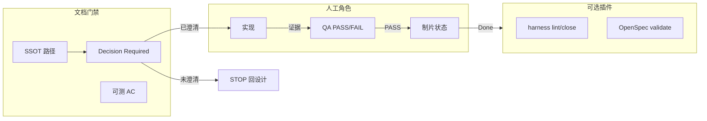

# lite-harness 轻量化修改意见（RFC）

**状态**：已增量采纳；原评审意见保留，未采纳项不作为执行要求

**日期**：2026-09-15  
**受众**：lite-harness 维护者与后续实现 agent  
**来源**：CoTrain 多角色评审共识（Unity Tech Lead / Producer / Engineering 连续性 / QA / Systems Design）

本文保留 CoTrain 多角色评审意见，并记录与本地已实现行为的对照及增量采纳结果。不替代 OpenSpec 上游设计，也不写入 CoTrain 专属玩法规则。

> **阅读顺序与效力**：先读 §0 的采纳结论，再读 §7、§10 的现行执行说明。§1–§6、§8–§9 保留原评审内容（包括角色逐字条款），属于基于旧版本的历史意见；其中“必须”“默认”“当前”等表述不直接修改仓库规则。现行工作规则以根目录 [CLAUDE.md](../../CLAUDE.md) 为准。尤其不得按旧建议恢复 current/单槽、新增 profile 或放松自动循环门槛。

## 0. 本地实现对照与采纳结论

基线核对：远端 PR #5（`1a222bb`）新增本 RFC 及角色补充，本地 `bc1c510` 已合并它，并领先 5 个提交（含合并提交）。本地实现已先于 RFC 完成部分轻量化目标；不能把旧基线草图当成当前运行方式。

| 评审建议 | 当前实现与本次结论 |
| --- | --- |
| 默认轻量协作、工具按需使用 | `e854890` 已实现；保留日常协作默认，见[默认日常协作 ADR](../adr/20260909-default-lightweight-collaboration.md)。 |
| 移除重复状态与单 active 槽 | `f769597` 已删除 current 和状态写入入口，见[直接查询 OpenSpec ADR](../adr/20260909-query-openspec-without-current.md)。不恢复可选文件、单槽或旧输入兼容层；旧文件只用于人工迁移。 |
| Spec/AC、证据与设计门禁 | 本次补齐需求权威与评估判据的边界；影响实现的未决问题先澄清，缺必需证据不得声称验收通过。 |
| Producer / QA / Design 权限 | 由采用项目在已有权威文档声明并链接；采用该多角色流程后执行其门禁。普通日常任务不强制配齐角色。 |
| 全局 lite/strict 配置、可选提交隔离 | 本轮不采纳；按任务选择工作方式，自动循环继续使用不同 agent/model 及现有提交隔离。 |
| 默认手动归档、七项改为辅助报告 | 本轮不采纳；日常任务无需归档，已有自动循环保留七项门槛、人工步骤、blocker 和回滚点。就绪/归档不代替项目约定的 QA 与 Done 确认。 |
| 看板及脚本可选、证据 SSOT | 保持现状并统一说明；选用自动循环后仍完整执行契约，不新建状态权威。 |

本次增量决定见[增量采纳 ADR](../adr/20260915-incremental-slim-rfc-adoption.md)。公共 CLI、API、JSON schema 和运行时行为不变。

---

## 1. 背景与动机

lite-harness 当前将 OpenSpec 变更管理与 `.harness` 脚本、看板、七项自动归档、Generator/Evaluator 提交隔离、`active_change` 唯一执行槽等绑在同一「每轮必做」循环里。对长时 agent 与多角色并行（实现 / 设计 / QA / 制片）而言，出现三类摩擦：

1. **仪式成本**：每轮强制 `harness status`、`openspec list`、维护 `current.json`、看板与 autoclose 就绪度，与「从权威文档恢复上下文」的目标重复，噪声大于信号。  
2. **并发模型错位**：单一 `active_change` 与 Producer 侧多队列、并行角色天然冲突；机器层硬隔离提交（Generator vs Evaluator）在轻量团队或单 agent 场景过重。  
3. **人的判断被脚手架替代风险**：CLI/看板/autoclose 若被当作「已完成」的信号，会削弱 QA PASS/FAIL、Decision Required（DR）与 Spec 路径上的设计门禁。

轻量化不是放弃纪律，而是把**不可妥协的规则写进文档与证据契约**，把**可自动化的辅助**改为默认关闭、按需启用。

---

## 2. 必须保留（Must Keep）

以下原则在多角色评审中一致，**不得因轻量化而删除或弱化**。

| 主题 | 要求 |
| --- | --- |
| **SSOT** | 一种信息只有一个权威来源；目录约定清晰（原则 → 产品事实 → 变更设计 → 证据 → 归档）。 |
| **实现 vs 评估分离** | 实现方与判定验证结论方在流程上分离（角色/模型边界）；禁止「自批作业」作为组织规则，而非必须用同一套 commit 机器门禁表达。角色分工不默认绑定双提交隔离脚本，见 **§2.1 Agent / 跨 session** 第 2 条。 |
| **无证据不算完成** | 没有可核对证据时不得声称任务或变更完成；不得通过改 `tasks.md`、削弱 AC 或测试掩盖未完成工作。 |
| **ADR** | 长期架构决策继续落在 `docs/adr/`，与 OpenSpec change / 证据可追溯。 |
| **人工门禁（制片 / QA）** | Feature 状态看板（或等价权威状态文档）：**Decision Required 未澄清 → STOP**；**无 QA PASS 不得 Done**；谁有权改状态须在文档中写明。制片侧细则见 **§2.1 Producer**。 |
| **QA 主权** | CLI/看板**不能替代**人工 PASS/FAIL；工程师 smoke ≠ PASS；材料缺失 → **BLOCKED**；不得降低 AC；验收判断归 QA。验收口径与输出边界见 **§2.1 QA**。 |
| **设计门禁（系统设计）** | 规则先写清、AC 可测、工程师不必猜；**Spec 路径为玩法/行为权威**；Open Questions / DR 未关闭 → 非 Approved；应 STOP 回设计；脚手架不能代替「这条规则是否已决定？」。Approved Spec / AC 合同见 **§2.1 Systems Design**。 |
| **Agent 连续性** | 新会话从仓库内权威文档与 ROADMAP/交接行恢复，不依赖聊天记录。跨 session 恢复与并行派单见 **§2.1 Agent / 跨 session**。 |

### 2.1 角色补充条款

以下条文为各角色在评审中**逐字确认的补充意图**，与 §2 表格一并构成 Must Keep；不得在本 RFC 之外自行扩展政策。

#### Producer（小蓝）

1. 只有 Producer 正式改 Backlog→Done，实现方不能自勾完成。
2. Done 必须过 QA PASS，smoke ≠ PASS。
3. Decision Required / Spec 未 Approved 时不得拆实现 Task。

#### Agent / 跨 session（小青）

1. 每轮恢复上下文只读权威 `docs/*` + 当前 Feature/ADR，不强制跑 OpenSpec CLI / `current.json` 仪式。
2. Generator 与 Evaluator 用角色分工（实现 vs QA），不绑双提交隔离脚本。
3. 单 active 执行槽改为可选，默认可并行候选调研，由 Producer 排队派单。

#### QA（粉粉）

1. 验收权威只认 Spec/AC 路径，冲突以 SPEC 为准。
2. 工程师 smoke / Cloud 静态 ≠ PASS，缺证据或实机未跑就 BLOCKED。
3. QA 只回 PASS/FAIL/BLOCKED，禁止降 AC、禁止改规则/自修后勾过。

#### Systems Design（小灰）

1. 玩法权威只认 Approved Spec 路径（如 `docs/specs/`），冲突以父 SPEC 为准，CLI/看板状态不能顶替规则正文。
2. Decision Required / Open Questions 未关不得标 Approved，Engineer 遇未定义规则必须 STOP 打回 Design，禁止猜规则或为 Bug 改 Design。
3. AC 是 Design↔实现↔QA 的合同，改核心规则走变更流程，不得用脚手架 autoclose 自动关掉 Open Question。

---

## 3. 建议默认关闭 / 可选插件（Default-Off / Optional Plugins）

下列能力**保留在仓库中**，但从「happy path 必用」改为**显式启用**（环境变量、配置文件或 `lite-harness.json` 等等价机制——具体形态由实现阶段决定）。

| 能力 | 说明 |
| --- | --- |
| **OpenSpec CLI 每轮仪式** | `openspec list` / 每轮 validate 等改为：在归档前、CI 中或 change 进入「待合并」时运行，而非 agent 每轮起手式。 |
| **`.harness/scripts/harness` 全家桶** | `status` / `ready` / `next` / `lint` / `check` / `autoclose` 等作为**可选插件**；最小 adopters 可只读 `docs/*` + 手写 `verification.json`。 |
| **Dashboard（`board.sh` / `board.cmd`）** | 本地看板可选；人工勾选与状态变更也可在 Feature 状态板（文档或外部工具）完成。 |
| **七项就绪度 + `harness autoclose`** | 就绪度计算可作为**辅助报告**；默认不自动 `close` / `openspec archive`。 |
| **Generator/Evaluator 提交隔离（机器门禁）** | 保留为**严格模式**插件：大型多 agent 仓库可开启；默认用流程规则 + PR 审查 + `verification.json` 角色字段约束。 |
| **`sync-feature-index.py` / feature-index** | 能力索引可选；小项目可直接查 `openspec/specs/`。 |
| **`prescreen-quality-docs.py` 等质量预筛** | 保留脚本，默认不在每轮循环强制运行；在 PR 或发布前由人或 CI 触发。 |
| **环境探针 `init.sh` / `init.ps1`** | 仍按 change 的 `program.md` 与验证契约决定是否运行，非每轮默认。 |

**插件原则**：SSOT 在 `docs/`、`openspec/`、约定证据目录；脚本只**读写**这些文件，不成为第二套真相。

---

## 4. 从 Happy Path 移除或降级（Remove / Demote）

这些项不应再作为「每个 agent 每轮」的默认假设；可迁入「严格模式」或文档中的推荐实践。

| 当前习惯 | 建议 |
| --- | --- |
| 每轮必先 `harness status` + 非零即停 | 改为：读 active change 的 `proposal.md` / `tasks.md` / Spec 路径 + ROADMAP 交接；`status` 仅在怀疑漂移或启用 harness 插件时使用。 |
| 每轮 `openspec list` | 降级为变更列表页/目录浏览；CLI 用于校验与归档节点。 |
| 强制维护 `.harness/current.json` 为每轮写路径 | 降级为**可选恢复点**；并行多角色时用 Feature 状态板 + change 目录 + PR 分支表达并行，而非单槽互斥。 |
| `active_change` 唯一执行槽作为全局硬规则 | 降级为**推荐默认**（避免多 change 同时改 specs）；与多角色队列冲突时以文档状态与分支策略为准，不由机器单槽挡并行。 |
| `harness autoclose` 驱动归档 | 默认改为人工或 maintainer 触发 `harness close` / `openspec archive`（或 CI 在 merge 后）；autoclose 仅严格模式。 |
| Dashboard 作为状态真源 | 看板只读或可选；**权威状态**在约定路径（如 Feature 板、change 内 `verification.json`、QA 记录）。 |
| 七项判据全部机器算完才「能声称做完」 | 七项可作为 close 前 checklist；**Done** 仍以 QA PASS + 证据为准，不由 autoclose 单独成立。 |

**不删除文件**：本 RFC 不要求在本阶段删除 `.harness` 脚本；仅调整文档默认叙事与后续实现的默认开关。

---

## 5. 目标工作流草图（对比当前循环）

### 5.1 当前 lite-harness 循环（摘要）

```text
pwd → harness status → openspec list → 读 active_change 文档
→ architecture / scorecard → 可选 init 探针
→ 单 active_change 实现 → harness check（隔离提交）→ 七项就绪 → autoclose
```

### 5.2 目标「轻量默认」循环

```text
pwd → 读 AGENTS/CLAUDE 原则
→ 定位权威 Spec 路径 + 当前 change（openspec/changes/<id>/ 或 Feature 板）
→ 若 DR / Open Questions 未关闭 → STOP（回到设计，不实现）
→ 读 tasks + AC + program/verification 契约
→ 实现角色：改代码 + 写证据到约定目录（PR、.harness/evidence/、verification 步骤）
→ QA 角色：人工 PASS/FAIL（工程师 smoke 仅作输入，非终态）
→ 制片：状态板更新；无 QA PASS 不得 Done
→ 归档：人工/CI 在证据齐全后 openspec archive（可选 harness lint 插件预检）
```



**对比要点**：

- **恢复上下文**：主要靠 `docs/*` + change 内设计 + ROADMAP/交接行，而非 `current.json` 单点。  
- **完成定义**：证据 + QA PASS + 制片规则，而非 autoclose 七项全绿。  
- **实现 vs 评估**：角色分离保留；默认用不同 agent/PR 审查表达，严格模式才启用提交隔离校验。

---

## 6. 迁移与兼容（现有采用方）

| 场景 | 建议 |
| --- | --- |
| 已深度依赖 `harness status` / autoclose | 继续运行；在项目中增加配置显式声明 `strict: true`（或等价项），行为与今日 main 一致直至 Phase 2。 |
| 已使用 Dashboard 管理任务勾选 | 可不变；文档标明看板非 SSOT，与 `tasks.md` / Feature 板对齐方式由项目自定。 |
| `current.json` 已有历史恢复点 | 保留文件与 schema；轻量模式下列为可选，不强制每轮更新。 |
| `verification.json` + `program.md` | **继续推荐**为 change 级证据契约；与轻量化目标一致，无需废弃。 |
| OpenSpec 目录结构 | 不变；本 RFC 不修改 OpenSpec 上游 CLI 语义。 |
| 更新器 `update-harness` | 仍可拉取插件脚本；默认文档（AGENTS/CLAUDE/README）应区分「核心约定」与「可选插件清单」。 |

**破坏性变更策略**：默认行为变更（关闭 autoclose、弱化单槽）仅在 **主版本或显式 opt-in** 后生效；文档先行（Phase 0）。

---

## 7. 增量实施记录（替代原 Phase 0–2 执行指引）

原 Phase 0–2 的全局 profile、单槽兼容层和默认手动归档路径不再作为实施顺序。当前交付范围为：

1. 校准 RFC 的历史基线和采纳状态，保留角色原文；同步提案索引及入口文案。
2. 在 `CLAUDE.md` 明确 Spec/AC、未决问题、证据和项目声明的角色权限；循环说明及 program 模板引用这些规则，评估判据不得覆盖需求。
3. 统一 README、使用指南、看板及升级说明；采用项目手动合并项目自有规则，保留现有角色政策、验证和归档契约。
4. 用 ADR 记录取舍；校验文档引用和差异格式，并核对普通小修、多角色项目、已有自动循环三个场景。

本次是文档与模板说明更新，不创建空 OpenSpec change，不引入配置或运行时改造。放松门槛或改变归档行为需要另行设计。

---

## 8. 非目标（Non-Goals）

- **不重写 OpenSpec 上游** CLI、schema 或社区工作流。  
- **不在 lite-harness 内定义 CoTrain 专属玩法、关卡或 Feature 板字段**；仅约定「应有权威 Spec 路径、DR 门禁、QA PASS」等可移植规则。  
- **本 RFC 不删除** `.harness/scripts`、dashboard 或 autoclose 实现（除非后续独立 change 明确范围）。  
- **不用新脚手架替代设计判断**：Generator、模板、autoclose 均不能回答「Decision Required 是否已关闭」。  
- **不降低证据与 AC 标准**；轻量化是减少重复仪式，不是减少验证深度。

---

## 9. 角色共识索引（追溯）

| 角色 | 保留 | 削减 / 可选 | 偏好形状 |
| --- | --- | --- | --- |
| Unity Tech Lead（黑团） | SSOT、实现/评估分离、无证据不完成、ADR | OpenSpec 每轮仪式、dashboard、七项 autoclose、提交硬隔离、单 active 槽 vs 多队列 | SSOT 目录 + 证据门 + ADR；脚本可选插件 |
| Producer（小蓝） | Feature 状态板、DR 不清则 STOP、无 QA PASS 不 Done | — | 权威文档路径 + 证据阈值 + 状态变更权限；脚本可选 |
| Engineering / 连续性（小青） | 权威文档恢复、无证据不完成 | 每轮 current.json / OpenSpec / 看板 / autoclose；单槽 vs 并行角色 | `docs/*` SSOT、ROADMAP 交接、PR/证据目录；角色分责不叠 CLI |
| QA（粉粉） | 无证据不完成；smoke≠PASS；缺料 BLOCKED；不降 AC | CLI/看板替代 PASS/FAIL | 判断归 QA |
| Systems Design（小灰） | 规则先行、可测 AC、Spec 权威、DR 未关非 Approved | 用 CLI/generator/autoclose 强迫设计完成 | Spec 路径 + DR 门 + AC 契约 |

---

## 10. 后续 agent 阅读入口

1. 从根目录 `CLAUDE.md` 恢复现行规则，核对 Git 状态与相关 ADR；不要把本 RFC 的历史“当前循环”当成实现事实。
2. 查看 §0 的采纳结论；默认日常协作和移除 current 已完成，不重复实现。
3. 普通任务遵循日常协作；接续已有 change 时保留自动循环的独立评估、人工步骤与全部门槛。
4. 升级采用项目时按 `index.md` 手动合并自有规则；新增全局配置或改变归档机制不属于本次授权范围。

---

*本文同时保留历史修改意见与采纳记录；未采纳建议不代表当前默认行为。*
